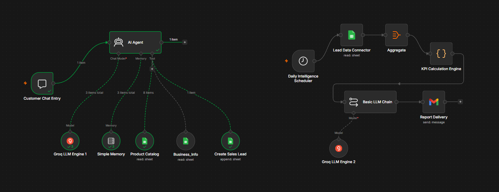
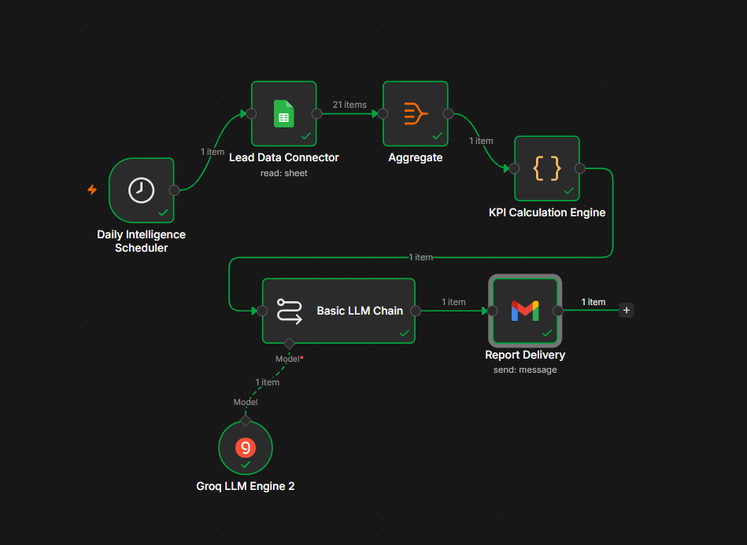
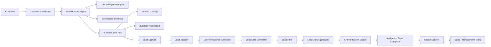

# BizFlow Agentic AI

### Agentic AI + AI Automation for Customer Sales and Sales Intelligence

BizFlow Agentic AI is an end-to-end business automation system built with **n8n**. It combines a tool-using customer sales agent with an automated sales intelligence and reporting workflow.

**Technologies:** n8n · Agentic AI · AI Automation · Groq · LLMs · Google Sheets · Gmail · JavaScript

---

## See the System

The following image shows the actual n8n implementation of both workflows.



**Two workflows. One connected business process.**

* **Workflow 1 — Customer Sales Agent:** handles customer conversations, accesses business tools and memory, and creates leads.
* **Workflow 2 — Sales Intelligence & Reporting:** processes lead data, calculates verified KPIs, generates a report with an LLM, and sends it to the Sales and Management team.


---

# What I Built

BizFlow combines two complementary approaches:

| Component                      | Purpose                                                                             |
| ------------------------------ | ----------------------------------------------------------------------------------- |
| Customer Sales Agent           | Agentic AI for customer interaction, business tool use, and lead capture            |
| Sales Intelligence & Reporting | AI automation for data processing, KPI calculation, report generation, and delivery |

The complete flow is:

```text
Customer
   |
   v
Customer Sales Agent
   |
   +-- LLM Intelligence Engine
   +-- Conversation Memory
   +-- Business Tool Hub
           |
           +-- Product Catalog
           +-- Business Knowledge
           +-- Lead Capture
                    |
                    v
               Lead Registry
                    |
                    v
          Sales Intelligence
                    |
                    v
          KPI Verification
                    |
                    v
         Report Generation
                    |
                    v
            Report Delivery
                    |
                    v
        Sales / Management Team
```

---

# Workflow 1 — Customer Sales Agent

## Purpose

The Customer Sales Agent is the customer-facing part of BizFlow.

It uses an AI Agent with an LLM, conversation memory, and business-specific tools to handle customer interactions and capture leads.

## Workflow

```text
Customer
   |
   v
Customer Chat Entry
   |
   v
BizFlow Sales Agent
   |
   +-------------------+-------------------+
   |                   |                   |
   v                   v                   v
LLM Intelligence   Conversation       Business Tool
     Engine           Memory               Hub
                                           |
                             +-------------+-------------+
                             |             |             |
                             v             v             v
                       Product Catalog  Business      Lead Capture
                                        Knowledge         |
                                                         v
                                                    Lead Registry
```

## Components

| Component               | Responsibility                                                     |
| ----------------------- | ------------------------------------------------------------------ |
| Customer Chat Entry     | Starts the customer conversation                                   |
| BizFlow Sales Agent     | Orchestrates the customer interaction and uses the available tools |
| LLM Intelligence Engine | Provides the language-model capability for the agent               |
| Conversation Memory     | Maintains conversational context                                   |
| Business Tool Hub       | Provides the agent with access to business-specific capabilities   |
| Product Catalog         | Provides product information                                       |
| Business Knowledge      | Provides business information                                      |
| Lead Capture            | Creates a lead from the customer interaction                       |
| Lead Registry           | Stores the resulting lead information                              |

## Agent Tools

The agent has access to three business functions:

```text
BizFlow Sales Agent
        |
        v
Business Tool Hub
        |
        +-- Product Catalog
        |
        +-- Business Knowledge
        |
        +-- Lead Capture
```

This allows the customer-facing agent to work with business information and perform a lead-capture action instead of functioning only as a conversational interface.

## Workflow Screenshot


---

# Workflow 2 — Sales Intelligence & Reporting

## Purpose

The second workflow automates the internal sales reporting process.

It reads lead data, processes the records, calculates verified KPIs programmatically, uses an LLM to write and design the report, and sends the final report through Gmail.

## Workflow

```text
Daily Intelligence Scheduler
          |
          v
Lead Data Connector
          |
          v
Lead Filter
          |
          v
Lead Data Aggregator
          |
          v
KPI Verification Engine
          |
          v
Intelligence Report Composer
          |
          v
Report Delivery
          |
          v
Sales / Management Team
```

## Components

| Component                    | Responsibility                                                   |
| ---------------------------- | ---------------------------------------------------------------- |
| Daily Intelligence Scheduler | Starts the reporting workflow on schedule                        |
| Lead Data Connector          | Reads lead records from Google Sheets                            |
| Lead Filter                  | Filters the required lead records                                |
| Lead Data Aggregator         | Combines the selected records for processing                     |
| KPI Verification Engine      | Calculates the required sales KPIs programmatically              |
| Intelligence Report Composer | Uses an LLM to write and structure the sales intelligence report |
| Report Delivery              | Sends the final HTML report through Gmail                        |

## Data and AI Separation

A deliberate part of the design is the separation between **calculation** and **report generation**.

```text
Lead Records
     |
     v
Lead Processing
     |
     v
KPI Verification Engine
     |
     v
Verified KPI Data
     |
     v
Intelligence Report Composer
     |
     v
HTML Report
     |
     v
Gmail
```

The Code node performs the KPI calculations, while the LLM is used to write and structure the resulting report.

## Workflow Screenshot




---

# Final Output

The workflow produces a sales intelligence report and delivers it to the intended Sales and Management recipients through Gmail.


---

# Architecture



---

# Agentic AI

Workflow 1 demonstrates the agentic side of the system.

The **BizFlow Sales Agent** is connected to:

* an LLM
* conversation memory
* business-specific tools

The agent can use these tools as part of the customer interaction rather than depending only on a fixed conversational response.

```text
Customer
   |
   v
BizFlow Sales Agent
   |
   +-- LLM
   +-- Memory
   +-- Business Tools
          |
          +-- Product Catalog
          +-- Business Knowledge
          +-- Lead Capture
```

---

# AI Automation

Workflow 2 demonstrates the automation side of the system.

The workflow executes a repeatable business process without requiring manual preparation of the daily report.

```text
Scheduled Execution
       |
       v
Lead Data
       |
       v
Processing
       |
       v
Verified KPIs
       |
       v
AI Report Generation
       |
       v
Automated Email Delivery
```

This combines deterministic data processing with LLM-based report generation.

---

# Why BizFlow

BizFlow was designed around a practical sales workflow:

**Customer interaction generates lead data, and lead data becomes organized sales intelligence.**

The project therefore connects two different uses of AI:

**Agentic AI**

Intelligent customer interaction, memory, and business tool use.

**AI Automation**

Scheduled processing, KPI calculation, report generation, and automated delivery.

Together, they form a connected business automation workflow rather than an isolated AI chatbot.

---

# Technology Stack

| Technology    | Use                                        |
| ------------- | ------------------------------------------ |
| n8n           | Workflow orchestration and automation      |
| Groq          | LLM inference for the customer sales agent |
| LLM           | Customer interaction and report generation |
| Google Sheets | Product, business, and lead data           |
| Gmail         | Automated report delivery                  |
| JavaScript    | KPI calculation and data processing        |

---

# Repository Structure

```text
BizFlow-Agentic-AI/
|
├── workflows/
|   ├── 01-customer-sales-agent.json
|   └── 02-sales-intelligence-reporting.json
|
├── screenshots/
|   ├── bizflow-workflows-overview.png
|   ├── workflow-01-customer-sales-agent.png
|   ├── workflow-02-sales-intelligence-reporting.png
|   └── daily-sales-report.png
|
├── README.md
└── LICENSE
```

---

# Running the Workflows

1. Import the workflow JSON files into an n8n instance.
2. Configure the required credentials and connections.
3. Connect the required Google Sheets, Groq, and Gmail resources.
4. Review the workflow configuration.
5. Execute the workflows using your own environment and data.

Do not upload API keys, passwords, access tokens, or other credentials to the repository.

---

# Security

Credentials should be managed through n8n's credential system or environment configuration.

Sensitive information should never be hard-coded into the workflow files.

---

# Current Scope

BizFlow currently includes:

**Customer Sales Agent**

Customer interaction, business information access, conversational memory, and lead capture.

**Sales Intelligence & Reporting**

Lead retrieval, filtering, aggregation, KPI verification, AI report generation, and automated Gmail delivery.

---

# Future Extensions

Possible extensions include CRM integration, lead scoring, sales follow-up automation, additional communication channels, historical sales analytics, and human approval steps.

---

# Author

**Irfan Ferdous Siam**

Computer Science and Engineering Undergraduate

Portfolio: https://irfanferdous.netlify.app/

GitHub: https://github.com/IrfanTech-X

LinkedIn: https://linkedin.com/in/irfan-ferdous-siam

---

## Project Summary

**BizFlow Agentic AI**

Agentic AI + AI Automation for Customer Sales and Sales Intelligence

**Built with:** n8n, Groq, LLMs, Google Sheets, Gmail, and JavaScript
