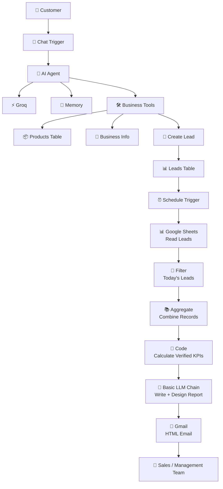
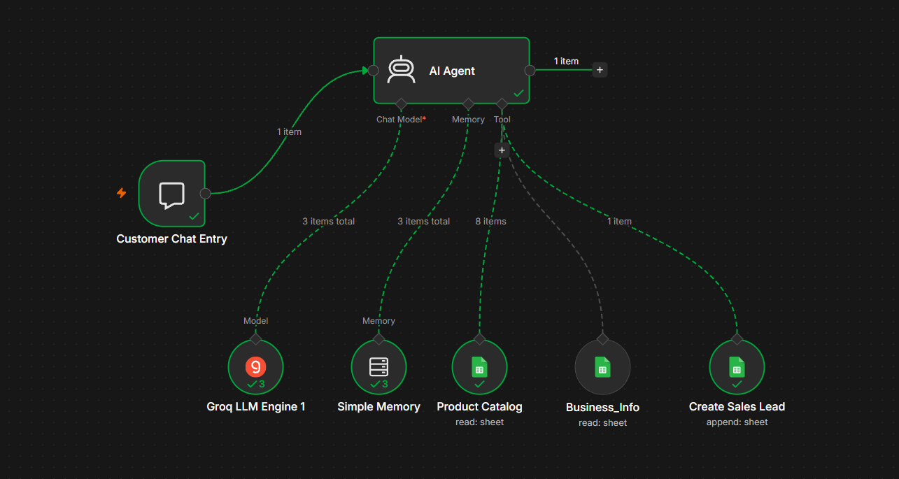
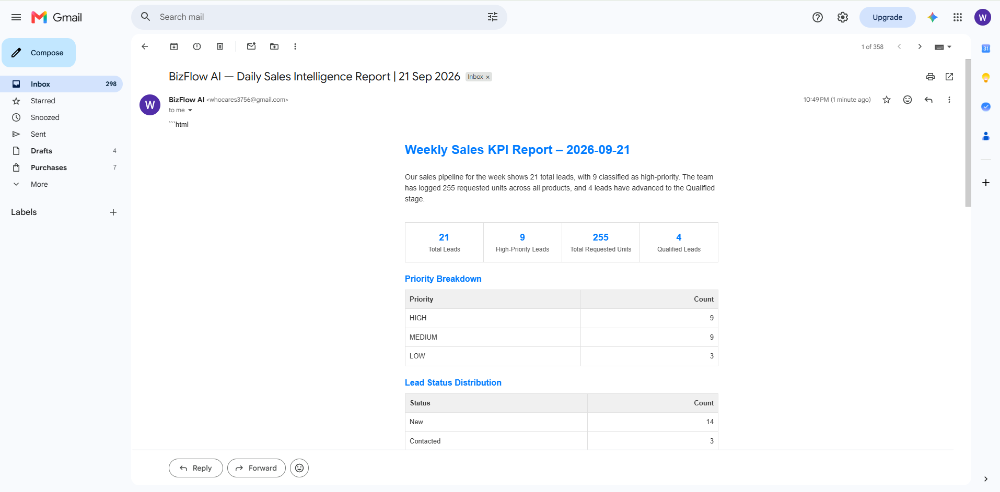

# BizFlow Agentic AI

> **Agentic AI for Customer Sales Automation & Daily Sales Intelligence**

BizFlow Agentic AI is an **AI-powered business automation system built with n8n** that combines a customer-facing sales agent with an automated daily sales-intelligence pipeline.

The system is composed of two specialized workflows:

* **Workflow 1 — Customer Sales Agent:** interacts with customers through a chat interface, uses business tools and memory, retrieves product/business information, and creates leads.
* **Workflow 2 — Daily Sales Intelligence:** automatically reads the day's leads, filters and aggregates records, calculates verified KPIs, generates a structured report with an LLM, and delivers it to the Sales/Management team through email.

The project demonstrates how **AI agents, tool use, workflow orchestration, deterministic data processing, and generative reporting** can be combined into a practical business automation system.

---

## 🧩 Project Architecture



### End-to-End Flow

```text
Customer
   ↓
Chat Trigger
   ↓
AI Agent
   ├── Groq
   ├── Memory
   └── Tools
        ├── Products Table
        ├── Business Info
        └── Create Lead
                ↓
           Leads Table
                ↓
        [Daily Schedule]
                ↓
        Read Lead Records
                ↓
         Filter Today's Leads
                ↓
          Combine Records
                ↓
        Calculate Verified KPIs
                ↓
        LLM Report Generation
                ↓
            HTML Email
                ↓
       Sales / Management Team
```

---

# 🔵 Workflow 1 — BizFlow AI Customer Sales Agent

## Purpose

The Customer Sales Agent handles customer-facing sales interactions through an n8n chat workflow.

Instead of relying only on an LLM's general knowledge, the agent is equipped with **business-specific tools** and **memory** so that it can interact with customers using information stored in the business data layer.

## Workflow

```text
                    BIZFLOW AI
                        │
                        ▼
                 ┌──────────────┐
                 │ Chat Trigger │
                 └──────┬───────┘
                        │
                        ▼
                 ┌──────────────┐
                 │   AI Agent   │
                 └──────┬───────┘
                        │
          ┌─────────────┼─────────────┐
          ▼             ▼             ▼
        Groq          Memory        Tools
                                      │
                           ┌──────────┼──────────┐
                           ▼          ▼          ▼
                       Products   Business    Create
                        Table       Info       Lead
                                                   │
                                                   ▼
                                              Leads Table
```

## Workflow Screenshot

> **Add your n8n workflow screenshot here**

```markdown

```

---

## Node Responsibilities

| Component          | Role                                                                               |
| ------------------ | ---------------------------------------------------------------------------------- |
| **Chat Trigger**   | Starts the customer interaction                                                    |
| **AI Agent**       | Orchestrates the customer conversation and decides when available tools are needed |
| **Groq**           | Provides the language-model reasoning/generation layer                             |
| **Memory**         | Maintains conversational context                                                   |
| **Products Table** | Provides product-related information to the agent                                  |
| **Business Info**  | Provides business-specific information                                             |
| **Create Lead**    | Creates a new lead when customer information should be captured                    |
| **Leads Table**    | Stores created lead information for later sales intelligence                       |

---

## 🛠️ Tool-Using Agent

A key feature of Workflow 1 is that the AI Agent is connected to business tools.

```text
                 AI Agent
                    │
          ┌─────────┼─────────┐
          │         │         │
          ▼         ▼         ▼
      Products   Business   Create Lead
       Table       Info
```

This allows the agent to move beyond a generic conversational chatbot and interact with structured business information.

---

## 🧠 Memory

The agent includes a memory component to maintain conversational context during customer interactions.

```text
Customer Message
       ↓
   AI Agent
       ↕
    Memory
       ↓
 Context-aware response
```

---

## 📦 Product & Business Information

The agent can access structured business information through its connected tools.

This allows customer responses to be grounded in the information available to the business rather than requiring all information to be embedded directly inside the prompt.

---

## 📝 Lead Creation

When a customer becomes a potential sales lead, the workflow can use the **Create Lead** tool to write the lead information into the Leads Table.

```text
Customer Conversation
        ↓
   Potential Lead
        ↓
    Create Lead
        ↓
    Leads Table
```

The resulting lead records become an important input for Workflow 2.

---

# 🟢 Workflow 2 — BizFlow AI Daily Sales Intelligence

## Purpose

The second workflow is an automated internal sales-intelligence pipeline.

It runs on a schedule, reads lead records, isolates the current day's leads, aggregates them, calculates verified KPIs, and then uses an LLM to produce a readable HTML report.

## Workflow

```text
              DAILY SALES INTELLIGENCE

Schedule Trigger
       │
       ▼
Google Sheets
   Read Leads
       │
       ▼
Filter
 Today's Leads
       │
       ▼
Aggregate
 Combine Records
       │
       ▼
Code
 Calculate Verified KPIs
       │
       ▼
Basic LLM Chain
 Write + Design Report
       │
       ▼
Gmail
 HTML Email
       │
       ▼
Sales / Management Team
```

## Workflow Screenshot

> **Add your n8n workflow screenshot here**

```markdown

```

---

## Node Responsibilities

| Component                          | Role                                                         |
| ---------------------------------- | ------------------------------------------------------------ |
| **Schedule Trigger**               | Automatically starts the workflow                            |
| **Google Sheets — Read Leads**     | Retrieves the available lead records                         |
| **Filter — Today's Leads**         | Selects records corresponding to the current day             |
| **Aggregate — Combine Records**    | Combines the selected lead records for downstream processing |
| **Code — Calculate Verified KPIs** | Performs deterministic KPI calculations                      |
| **Basic LLM Chain**                | Converts the calculated data into a readable sales report    |
| **Gmail — HTML Email**             | Sends the final report to the Sales / Management team        |

---

# 🧮 Deterministic KPI Calculation

An important design decision in Workflow 2 is the separation between **calculation** and **language generation**.

The Code node is responsible for calculating the verified KPI values before the LLM generates the report.

```text
Lead Records
     ↓
Filter
     ↓
Aggregate
     ↓
Code
     │
     ├── Verified KPI calculations
     │
     ▼
Basic LLM Chain
     │
     └── Report writing + presentation
```

This prevents the core numerical metrics from depending on the LLM's arithmetic or interpretation.

---

# 🧠 LLM Report Generation

After the KPI calculation stage, the **Basic LLM Chain** receives the prepared information and generates the daily sales-intelligence report.

Its responsibility is primarily:

```text
Verified Data
      ↓
LLM
      ↓
Written Business Report
      ↓
HTML Formatting
```

The LLM is therefore used for **communication and report generation**, while deterministic calculations are handled by the Code node.

---

# 📧 Automated Email Delivery

The final report is sent through Gmail as an HTML email.

```text
Verified KPIs
     ↓
LLM Report
     ↓
HTML Email
     ↓
Sales / Management Team
```

This removes the need for manually preparing and distributing the daily report.

## Email Output Screenshot

> **Add your generated report screenshot here**

```markdown

```

---

# 🔗 How the Two Workflows Work Together

The two workflows form a single business process.

### Workflow 1

**Customer interaction → business tools → lead creation**

### Workflow 2

**Lead records → KPI calculation → AI report → management email**

Combined:

```text
┌──────────────────────────────────────────────┐
│                BIZFLOW AGENTIC AI            │
└──────────────────────────────────────────────┘

              CUSTOMER LAYER
                   │
                   ▼
            Customer Sales Agent
                   │
          ┌────────┼────────┐
          ▼        ▼        ▼
       Product  Business  Create Lead
        Info      Info        │
                              ▼
                         Leads Table
                              │
                    ┌─────────┘
                    │
                    ▼
              DAILY INTELLIGENCE
                    │
              Read Lead Data
                    ↓
              Today's Leads
                    ↓
             Aggregate Records
                    ↓
             Verified KPIs
                    ↓
              LLM Report
                    ↓
              HTML Email
                    ↓
          Sales / Management Team
```

---

# 🎯 Business Use Case

BizFlow Agentic AI is designed around a simple business problem:

> **How can a business automate customer sales interactions while continuously converting incoming lead data into useful daily sales intelligence?**

The solution connects the customer-facing and internal-sales sides of the process.

### Customer side

The AI Agent can interact with customers and access:

* Product information
* Business information
* Conversational memory
* Lead creation functionality

### Internal side

The reporting workflow can:

* Read lead records
* Focus on today's leads
* Aggregate records
* Calculate verified KPIs
* Generate a structured report
* Deliver the report automatically by email

---

# ⚙️ Technology Stack

| Technology                 | Role                                           |
| -------------------------- | ---------------------------------------------- |
| **n8n**                    | Workflow orchestration and automation          |
| **Groq**                   | LLM inference for the customer-facing AI agent |
| **Google Sheets**          | Product/business/lead data layer               |
| **Gmail**                  | Automated report delivery                      |
| **LLM / Generative AI**    | Conversational responses and report generation |
| **JavaScript / Code Node** | Deterministic KPI calculation                  |

---

# 🧱 Repository Structure

```text
BizFlow-Agentic-AI/
│
├── workflows/
│   ├── 01-customer-sales-agent.json
│   └── 02-daily-sales-intelligence.json
│
├── screenshots/
│   ├── workflow-01-customer-sales-agent.png
│   ├── workflow-02-daily-sales-intelligence.png
│   ├── workflow-01-ai-agent.png
│   ├── workflow-01-tools.png
│   ├── workflow-02-kpi-calculation.png
│   └── daily-sales-report.png
│
├── docs/
│   └── architecture.md
│
├── README.md
└── LICENSE
```

---

# 📸 Project Screenshots

## Workflow 1 — Customer Sales Agent

```markdown

```

## Workflow 2 — Daily Sales Intelligence

```markdown

```

## AI Agent Configuration

```markdown

```

## Business Tools

```markdown

```

## KPI Calculation

```markdown

```

## Generated Report

```markdown

```

> Replace the image filenames above with your actual screenshot filenames later if you choose different names.

---

# 🔍 How to Inspect the n8n Workflows

The repository contains the exported n8n workflow JSON files.

```text
workflows/
├── 01-customer-sales-agent.json
└── 02-daily-sales-intelligence.json
```

To inspect the implementation:

1. Open the JSON workflow file.
2. Import it into an n8n instance.
3. Review the node connections and configurations.
4. Configure your own credentials and data sources.
5. Execute the workflow using your own environment.

---

# 🔐 Security

This repository should **never contain credentials or secret values**.

Do not commit:

```text
API Keys
Access Tokens
Passwords
OAuth Secrets
Private Credentials
Webhook Secrets
```

Use n8n credential management and environment configuration for sensitive values.

---

# 🚧 Current Scope

The current implementation focuses on two business processes:

```text
1. Customer Sales Interaction
2. Daily Sales Intelligence
```

The project intentionally separates customer interaction from internal reporting.

The current workflows do not claim to replace a complete CRM or sales-management platform.

---

# 🔮 Future Extensions

Possible extensions include:

* CRM integration
* Automated lead scoring
* Lead prioritization
* Customer follow-up automation
* Sales pipeline tracking
* Slack or Microsoft Teams notifications
* Historical sales analytics
* Human approval steps before high-impact actions
* Additional specialized business agents

---

# 📌 Project Highlights

### Agentic AI

A tool-using customer-facing AI agent capable of interacting with structured business resources and creating leads.

### Business Automation

n8n connects customer interaction, data storage, KPI processing, reporting, and communication.

### Deterministic + Generative Architecture

Core KPI calculations are handled programmatically, while the LLM focuses on language generation and report presentation.

### End-to-End Workflow

The project connects customer conversations to operational sales intelligence.

---

# 👨‍💻 Author

**Irfan Ferdous Siam**

Computer Science & Engineering Undergraduate
AI/ML & NLP Enthusiast

**Portfolio:**
https://irfanferdous.netlify.app/

**GitHub:**
https://github.com/IrfanTech-X

**LinkedIn:**
https://linkedin.com/in/irfan-ferdous-siam

---

## ⭐ Project

**BizFlow Agentic AI**
*Agentic AI for Customer Sales Automation & Daily Sales Intelligence*

**Built with:** n8n • Groq • Google Sheets • Gmail • LLMs • JavaScript
